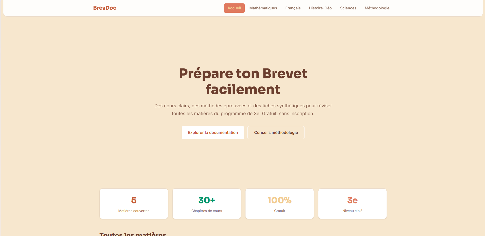

# BrevDoc

**BrevDoc** est un site de préparation au **Diplôme National du Brevet (DNB)** destiné aux élèves de **3e**. Il propose des **cours synthétiques**, des **méthodes** et des **rappels** organisés par matières : tu peux réviser facilement, sans inscription.

## Contenu du site

Le site est structuré autour de 6 pages principales :

- **Accueil** (`/`) : présentation + accès aux matières + calendrier des épreuves.
- **Mathématiques** (`/mathematiques`) : calcul, géométrie, fonctions, probabilités, équations.
- **Français** (`/francais`) : grammaire/conjugaison, orthographe, lecture analytique, rédaction, vocabulaire.
- **Histoire-Géographie & EMC** (`/histoire-geo`) : repères historiques, géographie des territoires et institutions.
- **Sciences (SVT & Physique-Chimie)** (`/sciences`) : notions clés avec formules et points d’attention.
- **Méthodologie** (`/methodologie`) : planning, fiches, mémorisation, oral (SpeAk) et jour J.

Chaque page :

- affiche des **chapitres** avec contenu (texte, listes, formules, callouts),
- propose des **vidéos explicatives** (intégrations YouTube),
- utilise une **navigation latérale (sidebar)** pour accéder directement aux sections.

## Stack / techno

- **Astro** (framework principal)
- Intégration de données côté front (pages Astro)
- Script optionnel de génération de ressources via scraping (voir ci-dessous)

## Lancer le site en local

### Prérequis

- **Node.js** installé

### Installation

```bash
npm install
```

### Mode développement

```bash
npm run dev
```

Puis ouvre l’URL affichée dans la console (souvent `http://localhost:4321`).

### Build (production)

```bash
npm run build
```

### Preview du build

```bash
npm run preview
```

## Scraping / ressources externes (optionnel)

Le projet contient un script pour récupérer/mettre à jour des ressources depuis une source externe.

## Screenshot



### Exécuter le script

```bash
npm run scrape:lumni
```

Le résultat dépend du contenu retourné par la source et de la façon dont le script enregistre/consomme ses données.

## Structure du projet (repères)

- `src/layouts/Layout.astro` : layout global (header, footer, navigation, styles)
- `src/pages/*.astro` : pages par matières (Accueil, Mathématiques, Français, Histoire-Géo, Sciences, Méthodologie)
- `src/components/` : composants réutilisables (sidebar, icônes, embed vidéo, etc.)
- `scripts/` : scripts utilitaires (ex: `scrape-lumni.js`)

## Bonnes pratiques d’édition

- Les **chapitres** sont définis en variables (ex: `chapters`) dans les fichiers de pages.
- Les blocs de contenu utilisent des types cohérents :
  - `text`, `list`, `formula`, `callout`
- Les ancres des sections sont générées via des fonctions `slug(...)` pour une navigation stable.

## Licence

Le projet utilise la licence indiquée dans `LICENSE.txt`.
